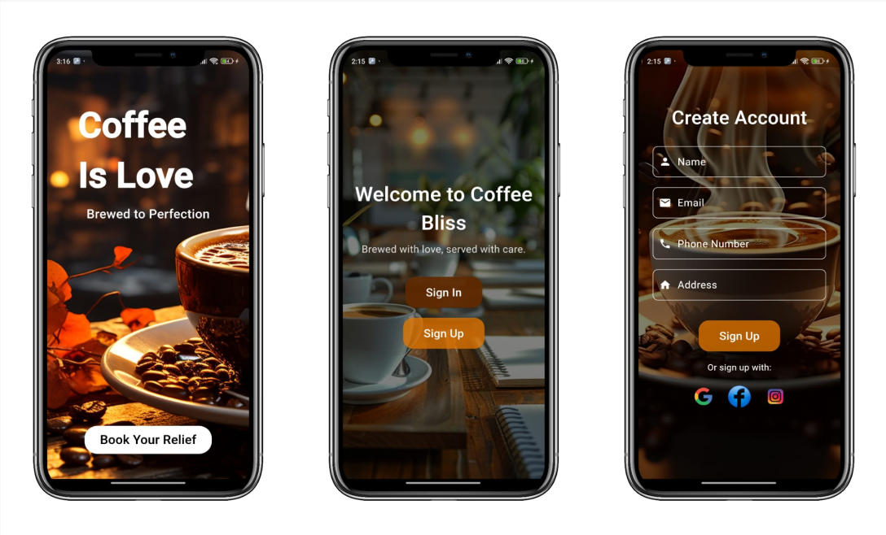
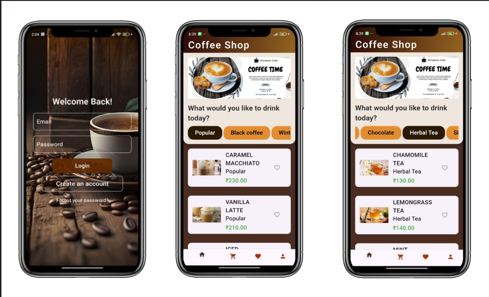
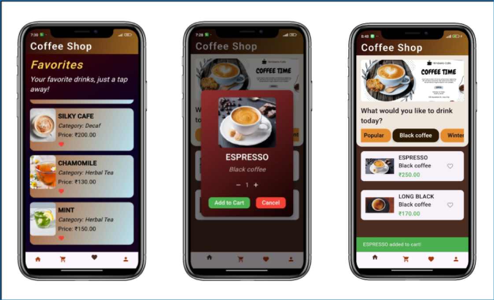
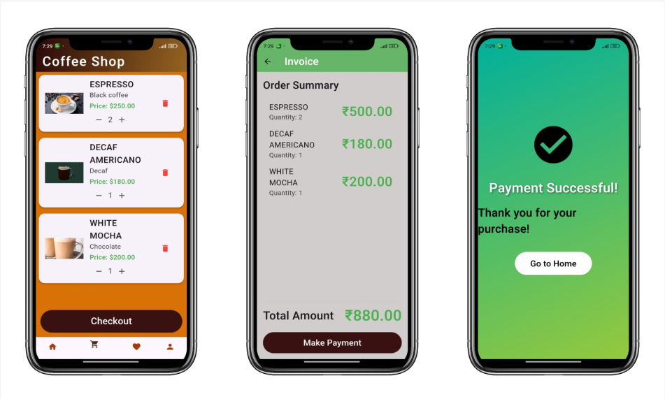

# coffee_shop
A cross-platform mobile application for a Coffee shop where users can create bookings for coffee  and make payment .

## App Screenshots

Here is a quick look at the app's screenshots:

## Getting Started

This project is a starting point for a Flutter application.

## App Features
- Splash screen
- User authentication (using Firebase)
- User registration
- Admin registration
- Admin dashboard with booking management
- Admin can view all bookings
- user can book coffee
- user make payment

## How to Run the App

To run the app, you'll need to set up Flutter and Dart on your machine.

Steps:
- Download Android Studio from the official website: https://developer.android.com/studio
- Download JDK from the official website: https://www.oracle.com/java/technologies/javase-jdk11-downloads.html
- Download the Flutter SDK from the official website: https://docs.flutter.dev/release/archive
- Download sdk version 3.22.1
- Unzip the downloaded Flutter SDK into a directory of your choice
- Open Android Studio and install Flutter & dart plugin
- Set up Flutter SDK in your system environment variables
- Specify the Flutter SDK path in your Android Studio settings

You can check reference videos on YouTube for detailed instructions:
https://youtu.be/mMeQhLGD-og?si=rXZQVFBjGOu12aM8

After completing these steps, follow these steps to run the app:
- Open Android Studio
- Select project from version control (VCS) and paste the project URL: https://github.com/sumaiya-akter-runa/coffee_shop
- Project will be imported into Android Studio
- Finally, run the app on an emulator or a physical device

## Packages Used in This Project

### **Core Dependencies**
- [http](https://pub.dev/packages/http) A composable, Future-based library for making HTTP requests.
- [provider](https://pub.dev/packages/provider) A state management library that allows dependency injection and state sharing between widgets.
- [shared_preferences](https://pub.dev/packages/shared_preferences) Provides persistent storage for simple data like user preferences and settings.

### **Media Handling**
- [image_picker](https://pub.dev/packages/image_picker) Enables the selection of images and videos from the device's camera or gallery.
- [image_cropper](https://pub.dev/packages/image_cropper) Allows users to crop selected images before further processing.

### **Icons and UI**
- [flutter_launcher_icons](https://pub.dev/packages/flutter_launcher_icons) Simplifies the process of configuring app launcher icons for Android and iOS.
- [cupertino_icons](https://pub.dev/packages/cupertino_icons) Provides a collection of iOS-style icons.
- [google_fonts](https://pub.dev/packages/google_fonts) Allows easy use of Google Fonts to customize typography in Flutter apps.
- [fluttertoast](https://pub.dev/packages/fluttertoast) A package for displaying toast messages in Flutter.

### **Firebase and Authentication**
- [firebase_core](https://pub.dev/packages/firebase_core) Initializes Firebase in a Flutter app, required for Firebase services.
- [firebase_database](https://pub.dev/packages/firebase_database) Provides access to Firebase Realtime Database for syncing data.
- [firebase_auth](https://pub.dev/packages/firebase_auth) A package for handling Firebase authentication (email/password, Google, Facebook, etc.).

### **Social Media Authentication**
- [google_sign_in](https://pub.dev/packages/google_sign_in) Enables Google Sign-In for authenticating users via Google accounts.
- [flutter_facebook_auth](https://pub.dev/packages/flutter_facebook_auth) Handles Facebook authentication in Flutter apps.

### **Web and URL Handling**
- [flutter_inappwebview](https://pub.dev/packages/flutter_inappwebview) A package for displaying web content inside your app using a WebView. Useful for OAuth login (e.g., Instagram).
- [url_launcher](https://pub.dev/packages/url_launcher) A package for launching URLs, including opening web pages, making calls, and sending SMS or emails.

### **Development Dependencies**
- [flutter_test](https://docs.flutter.dev/cookbook/testing) A testing framework for writing unit, widget, and integration tests in Flutter.
- [flutter_lints](https://pub.dev/packages/flutter_lints) Enforces recommended linting rules to maintain clean and consistent code in Flutter projects.

### **Icon Configuration**
The project includes a custom app launcher icon:
- **Platforms:** Android, iOS

## Image Resources
- [FlatIcons](https://www.flaticon.com/)   A platform offering free icons and stickers designed for projects, created by and for designers.
- [Pexels](https://www.pexels.com/) A free stock photo website that offers high-quality and free-to-use images for both personal and commercial projects.
- [Vecteezy](https://www.vecteezy.com/)   A rich resource for free vector art, illustrations, and icons, perfect for enhancing design elements.

